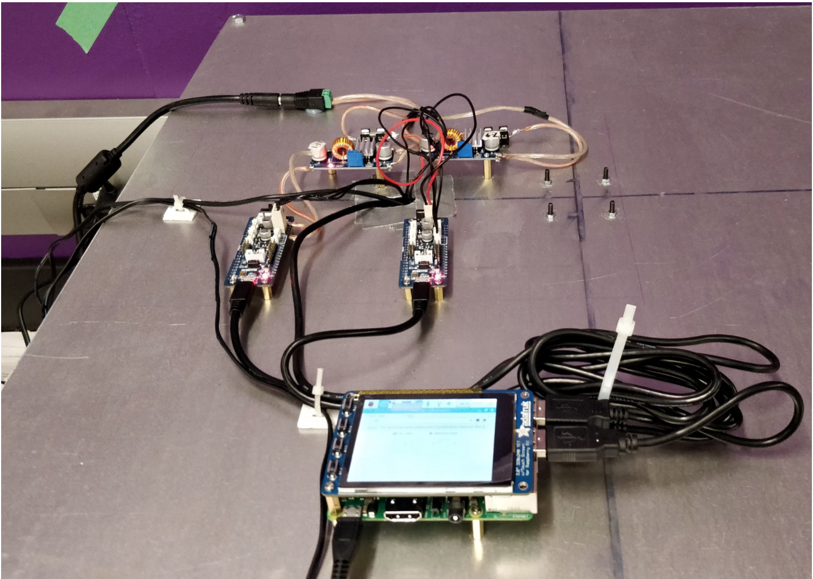
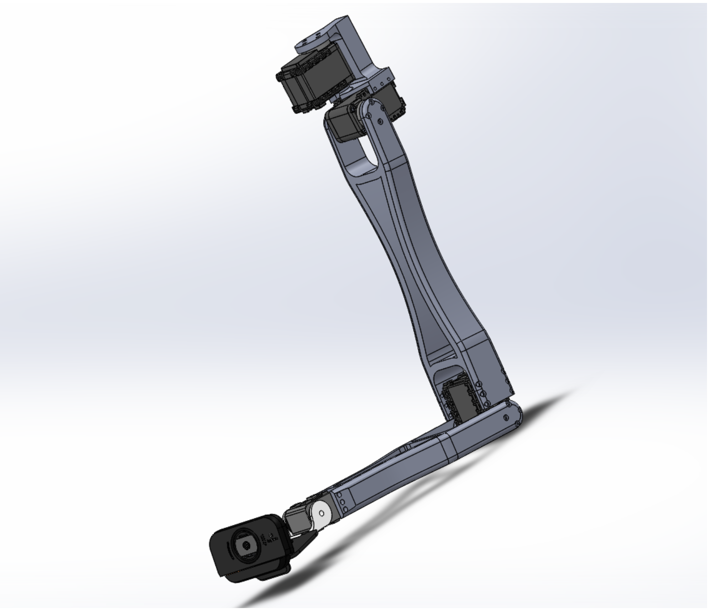

# INSPEKSI - An Intelligent Manufacturing Inspection Robot
Autodesk Capstone Award Winner (2019)

* Created a surface defect detection system using a myriad of vision and machine learning (deep learning) approaches
* Developed 4 DOF robotic arm with back driveability for customized scanning approaches and plans
* Created custom dataset using real vendors, products, and samples of different shapes and colors in variety of lighting
* Functionality tested and validated during pilot with Ecobee sensors

